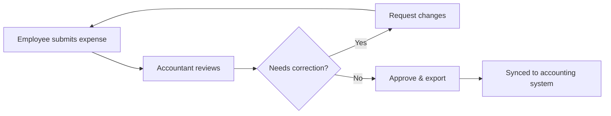

# Payhawk for Accountants

As an accountant, your job in Payhawk is to review submitted expenses, ensure they are correctly coded, and export them to your accounting or ERP system.

## The accountant workflow

## Reviewing expenses

Navigate to **Expenses → Review queue** to see all expenses pending your attention. For each expense you can:

- Verify the receipt is attached and legible
- Confirm the accounting code and cost centre
- Check VAT/tax treatment is correct
- Add notes or request corrections from the employee


Use **Bulk approve** to process multiple low-risk expenses at once — great for recurring card purchases from known merchants.


## Exporting to your accounting system

Once expenses are reviewed, export them to your accounting system from **Expenses → Export**. Payhawk supports:

- **Direct sync** (Xero, QuickBooks Online, NetSuite) — approved expenses sync automatically
- **Manual export** (CSV, PDF) — for systems without a native integration

## Reconciliation

Payhawk reconciles card transactions against your fund account balance in real time. To reconcile bank statements:

1. Go to **Fund Account → Bank Statements**
2. Select the statement period
3. Match statement lines to Payhawk transactions
4. Export the reconciliation report

## Common issues

An export failed with an error from my accounting system

Check the export error log under **Expenses → Export history**. Common causes include:
- Missing or invalid accounting code mapping
- Closed accounting period in the destination system
- API rate limit from the accounting provider (retry after a few minutes)

An employee's expense is stuck in review

The expense may be waiting for a required field (receipt, VAT rate, cost centre). Open the expense and check the **Missing fields** banner at the top.

